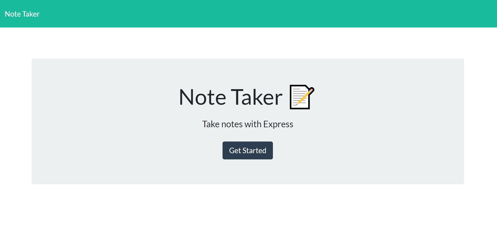
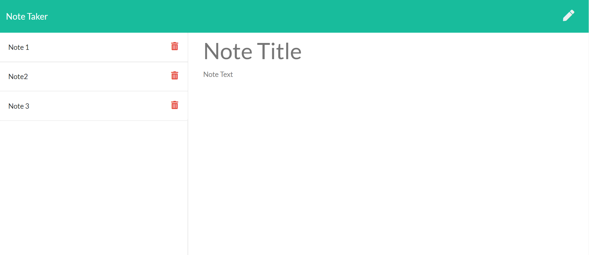
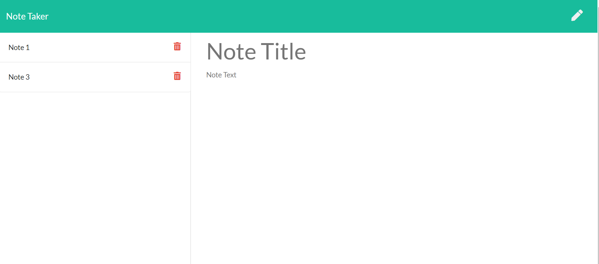

# Express Note Taker App

This application can be used to write, save, and delete notes. This application will use an express backend and save and retrieve note data from a JSON file.

## Link to deployed app
[Heroku](https://ancient-castle-96704.herokuapp.com/)

## App Description
This app is for users who need to keep track of a lot of information. It's easy to forget or be unable to recall something important. Being able to take persistent notes allows users to have written information available when needed.

## Installation
Run `npm i`
The dependencies are, `express`for the web appllication framework, and `uuid` for assigning a unique id for notes.

## Usage
Run the command `node server.js` connecting to the local server.

## Tests
* The following HTML routes should be created:

  * GET `/notes` - Should return the `notes.html` file.

  * GET `*` - Should return the `index.html` file

* The application should have a `db.json` file on the backend that will be used to store and retrieve notes using the `fs` module.

* The following API routes should be created:

  * GET `/api/notes` - Should read the `db.json` file and return all saved notes as JSON.

  * POST `/api/notes` - Should receive a new note to save on the request body, add it to the `db.json` file, and then return the new note to the client.

  * DELETE `/api/notes/:id` - Should receive a query parameter containing the id of a note to delete. This will give each note a unique `id` when it's saved. Read all notes from the `db.json` file in order to delete a note, remove the note with the given `id` property, and then rewrite the notes to the `db.json` file.

## Contact Information
Choyo Matsuta: [GitHub link](https://github.com/cmatsuta)

### Released under MIT License
Copyright <2020> Choyo Matsuta

Permission is hereby granted, free of charge, to any person obtaining a copy of this software and associated documentation files (the "Software"), to deal in the Software without restriction, including without limitation the rights to use, copy, modify, merge, publish, distribute, sublicense, and/or sell copies of the Software, and to permit persons to whom the Software is furnished to do so, subject to the following conditions:

The above copyright notice and this permission notice shall be included in all copies or substantial portions of the Software.

THE SOFTWARE IS PROVIDED "AS IS", WITHOUT WARRANTY OF ANY KIND, EXPRESS OR IMPLIED, INCLUDING BUT NOT LIMITED TO THE WARRANTIES OF MERCHANTABILITY, FITNESS FOR A PARTICULAR PURPOSE AND NONINFRINGEMENT. IN NO EVENT SHALL THE AUTHORS OR COPYRIGHT HOLDERS BE LIABLE FOR ANY CLAIM, DAMAGES OR OTHER LIABILITY, WHETHER IN AN ACTION OF CONTRACT, TORT OR OTHERWISE, ARISING FROM, OUT OF OR IN CONNECTION WITH THE SOFTWARE OR THE USE OR OTHER DEALINGS IN THE SOFTWARE.
install uuid